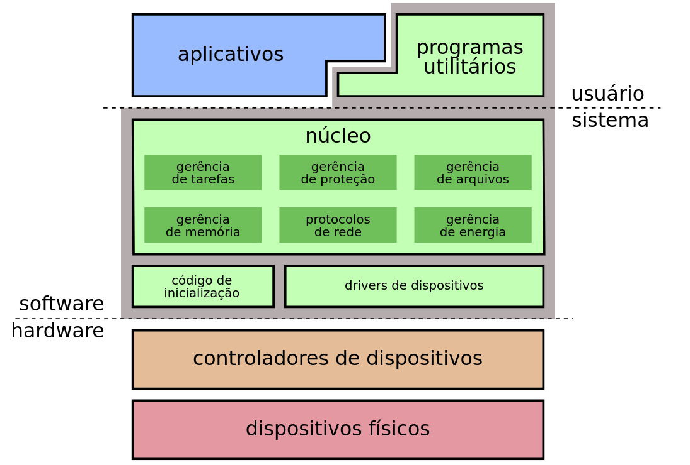
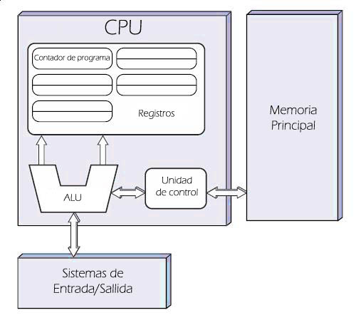
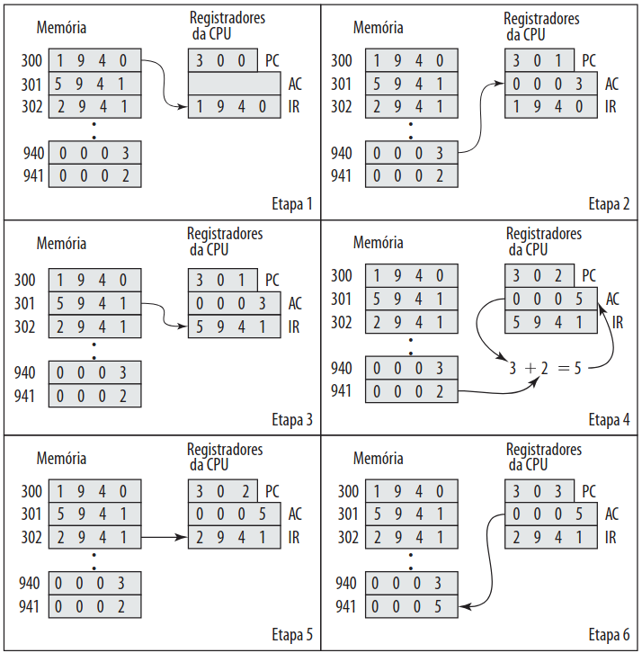
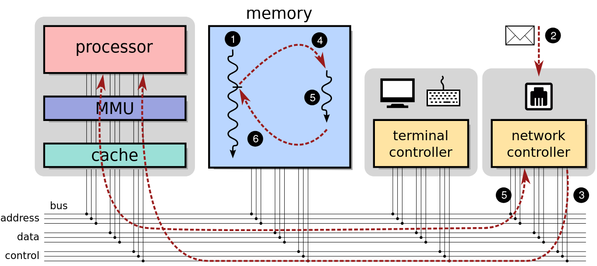
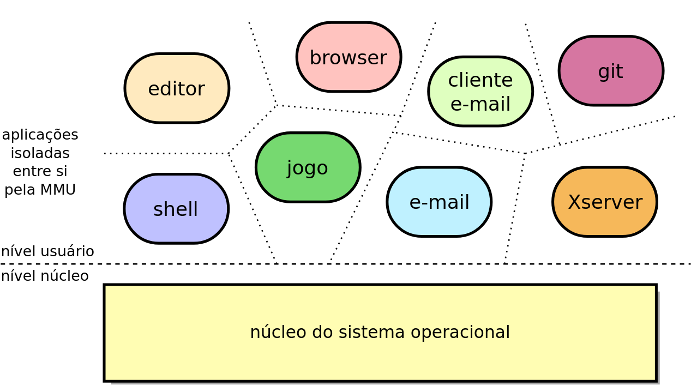
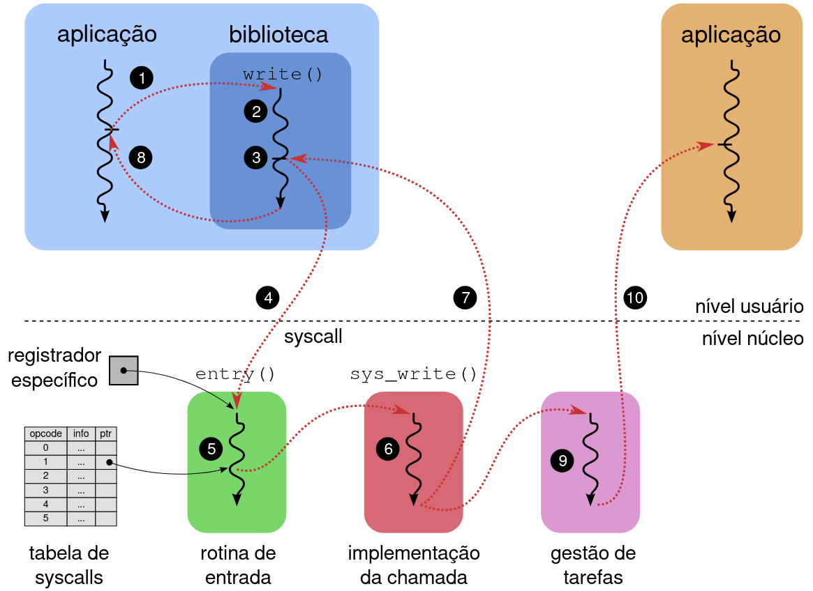
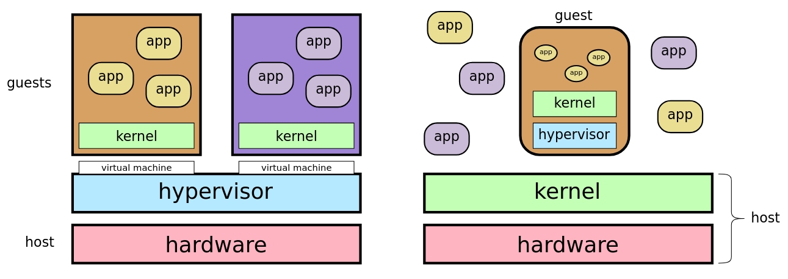
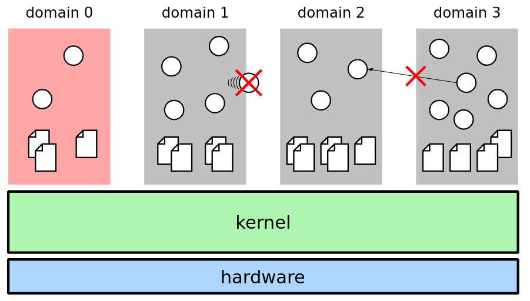

# Fundamentos

## O que é um S.O?

É um *software* responsável por gerenciar os componentes de hardware, além de prover uma interface para o usuário. 

## Para que ele serve?

- **Abstração (De Cima para Baixo)**: Facilitar acesso a estruturas de baixo nível. 
- **Gerenciar (De baixo para Cima)**: Coordenar o uso dos recursos pelos programas:
  - Permitir o uso compartilhado do processador;
  - Sequenciar acesso a determinados recursos (*Daemons*);
  - Impedir ataques de negação de serviço (*Denial of Service* - Arquivo cheio de zeros comprimido) 

---

## Estrutura de um SO

### Componentes Relevantes

- **Núcleo**: Gerência dos recursos do hardware usados pelas aplicações. Também implementa as principais abstrações.

    - A camada mais baixa do sistema operacional, que constitui o chamado “núcleo” do sistema ou (kernel), usualmente executa em um modo especial de operação do processador, denominado *modo privilegiado* ou *modo sistema*. Os demais programas e aplicações executam em um modo denominado *modo usuário*.

- **Inicialização(boot code)**: Reconhece os dispositivos instalados e carrega o núcleo do sistema na memória.

- **Drivers**: Módulos de código para acessar os dispositivos físicos.

- **Utilitários**: Funcionalidades complementares:
  - Formatação de discos,
  - Shell de comandos,
  - Interface gráfica, etc.

---



- **Política**: Aspecto abstrato de alto nível.
- **Mecanismo**: Procedimento baixo nível usado para implementar uma política.

>**Filosofia da estrutura:** separar políticas de mecanismos.
- As políticas devem ser independentes dos mecanismos

- Os mecanismos devem ser genéricos para várias políticas

## Arquitetura de um Computador
 Os computadores modernos partilha um conjunto universal de blocos de construção. Estes componentes interagem de forma coordenada para executar programas e processar dados.

- **Unidade Central de Processamento (CPU):** Frequentemente descrita como o "cérebro" do computador, a CPU é o componente responsável por executar as instruções de um programa. Ela é composta por duas subunidades principais:
    - **Unidade de Controle (CU - Control Unit):** Atua como o maestro do sistema. Ela busca instruções da memória, decodifica-as e gera os sinais de controle que dirigem as outras unidades para executar a tarefa especificada.
    - **Unidade Aritmética e Lógica (ALU - Arithmetic Logic Unit):** É o centro de cálculo da CPU. Realiza todas as operações matemáticas (como adição e subtração) e lógicas (como AND, OR e NOT) sobre os dados.6
- **Memória Principal (RAM - Random Access Memory):** É um dispositivo de armazenamento volátil que guarda temporariamente tanto as instruções dos programas em execução como os dados que estão a ser processados pela CPU.
- **Sistema de Entrada e Saída (E/S ou I/O):** Compreende o conjunto de dispositivos que permitem ao computador comunicar com o mundo exterior.
- **Sistema de Interconexão (Barramento):** É o conjunto de vias de comunicação que conectam a CPU, a memória principal e o sistema de E/S. O barramento permite a transferência de dados, endereços e sinais de controle entre estes componentes essenciais, unificando-os num sistema funcional.



---

### Ciclo de busca-decodificação-execução

- **Busca (Fetch):** O ciclo começa com a Unidade de Controle (CU) a buscar a próxima instrução a ser executada da memória principal. Para saber onde encontrar essa instrução, a CU consulta um registrador especial chamado Contador de Programa (PC - Program Counter), que armazena o endereço de memória da próxima instrução. A instrução é então transferida da memória para outro registrador dentro da CPU, o Registrador de Instrução (IR - Instruction Register). Após a busca, o PC é automaticamente incrementado para apontar para a instrução seguinte na sequência.

- **Decodificação (Decode):** Uma vez que a instrução está no IR, a CU analisa o seu código de operação (opcode). Esta fase de decodificação determina que tipo de operação a instrução representa (por exemplo, uma adição, uma leitura da memória, um desvio condicional) e identifica os operandos (os dados) necessários para a sua execução.

- **Execução (Execute):** A operação especificada é finalmente realizada. Esta fase pode envolver diferentes partes da CPU. Se for uma operação aritmética ou lógica, a ALU é ativada. Se a instrução exigir a leitura ou escrita de dados na memória, a CU coordena o acesso à memória. Se for uma instrução de desvio (jump ou branch), o valor do Contador de Programa (PC) é alterado para um novo endereço, quebrando a execução sequencial e fazendo com que o ciclo de busca seguinte comece a partir de um ponto diferente do programa.


---

## Interrupções

O processador se comunica com dispositivos através de portas de E/S, acessadas por sua iniciativa. Para eventos urgentes (como chegada de dados), o dispositivo pode enviar uma requisição de interrupção (IRQ –
Interrupt ReQuest). Ao recebê-la, o processador suspende sua tarefa atual e executa uma rotina de tratamento específica(Interrupt handler). Após o tratamento, retoma a execução normal.

Mecanismos de hardware usados para desviar a execução do
processador em caso de eventos:

- Interrupção : desvia a execução por evento externo, gerado por um periférico
- Exceção : desvia a execução por evento interno (erro numérico, etc)
- Trap : desvia a execução a pedido do software



```vmstat <time>``` retorna estatísticas do S.O a cada \<time> segundos


```more /proc/interrupts```  interrupções acontecendo no sistema


### Niveis de Privilégio

- **Nível núcleo(supervisor)**: 
  - Todas as instruções do processador
  - Todos os registradores
  - Todas as portas I/O
  - Todas as areas de memória

Usado pelo núcleo e drivers

- **Nível usuário(userspace)**:
  - Subconjunto dos de cima

Usado por aplicações





## Chamadas de Sistema

São funções que permitem o acesso aos serviços do núcleo:


  - Abrir/ler/escrever/fechar arquivos
  - Enviar/receber dados através da rede
  - Ler teclado
  - Escrever dados na tela

procede por interrupções pois é a única capaz de trazer uma requisção do nível de usuário para o nível do núcleo



1. Aplicação chama write(...) da biblioteca.
2. A função write preenche os registradores da CPU.
3. A função write invoca uma chamada de sistema.
4. A CPU vai para o núcleo e ativa a rotina de entrada(entry).
5. A rotina de entrada consulta a tabela de syscalls e ativa a função sys_write.
6. A função sys_write efetua a operação solicitada.
7. A CPU retorna à função write, em modo usuário. 
8. A função write retorna ao código principal da aplicação


```strace <function>``` mostra as chamadas de sistema geradas por uma aplicação


## Endereços de dispositivos 

```more /proc/ioports``` 

---
## Arquitetura de Sistemas Operacionais

### Máquinas Virtuais

  - Virtualização: simular em software um sistema computacional sobre outro sistema
  
    Um ambiente de máquina virtual consiste de três partes:
    1. Host: contém os recursos reais de hardware e software
    2. Hypervisor: constrói o sistema computacional virtual
    3. Guest: executa sobre o sistema virtual


    
    
    E - hypervisor nativo (*Xen*)

    D - hypervisor convidado (*VirtualBox*)

### Dockers

O **espaço de usuário** do sistema é dividido em **domínios isolados (contêineres)**.
- Cada domínio recebe uma **parcela dos recursos** do sistema: memória, CPU, disco, etc.
- Compartilham o **mesmo núcleo do sistema operacional**, mas têm espaços de usuário distintos.


#### 🌐 Isolamento de Recursos

  - Cada domínio possui:
    - Sua **interface de rede virtual** e **endereço de rede próprio**
    - Seu próprio **espaço de nomes** (para usuários, processos, diretórios, etc.)
  - Exemplo: pode haver um usuário `pedro` em `d3` e outro `pedro` em `d7`, sem conflito.

#### 🔒 Restrições e Comunicação

- Processos em **um mesmo domínio** podem se comunicar livremente.
- **Não há comunicação nem visibilidade entre domínios distintos** (ex: d2 e d3).
- **Processos não podem migrar entre domínios**, com exceção do domínio `d0(admin)`.


    
---


# Exercícios

**1. O que diferencia o núcleo do restante do sistema operacional?**

O núcleo (kernel) é o componente central do sistema operacional que executa em modo privilegiado (modo núcleo), dando-lhe acesso total ao hardware. O restante do sistema (aplicativos, interface de usuário) roda em modo restrito (modo usuário). A principal função do núcleo é gerenciar os recursos do sistema, como memória, processos e dispositivos, atuando como uma ponte entre o hardware e o software.  

**2. Seria possível construir um sistema operacional seguro usando um processador que não tenha níveis de privilégio? Por quê?**

Não. Pois sem essa separação, qualquer programa poderia acessar o hardware diretamente, modificar a memória do sistema e executar operações críticas, tornando o sistema instável e inseguro.  

**3. Haveria alguma utilidade para os níveis intermediários (anéis 1 e 2) da arquitetura x86?**

Sim, os anéis intermediários foram projetados para tarefas que exigem mais privilégios que aplicações comuns, mas menos que o núcleo, como drivers de dispositivo e virtualização.

**4. Quais as diferenças entre interrupções, exceções e traps?**

| Característica | Interrupção                  | Exceção                            | Trap (Interrupção de Software)          |
|----------------|------------------------------|------------------------------------|------------------------------------------|
| Origem         | Hardware externo             | Erro na execução de instrução (CPU) | Instrução de software intencional        |
| Sincronicidade | Assíncrona                   | Síncrona                           | Síncrona                                 |
| Propósito      | Lidar com eventos de hardware (E/S) | Lidar com erros de programa       | Solicitar serviço do SO (chamada de sistema) |

  

**5. O comando em linguagem C fopen é uma chamada de sistema ou uma função de biblioteca? Por quê?**

fopen é uma função de biblioteca. A razão é que ela faz parte da biblioteca padrão C (stdio.h) e fornece uma interface de alto nível e portátil. Internamente, fopen invoca a chamada de sistema específica do sistema operacional (como open() no Linux) para realizar a tarefa.

**6. Quais das seguintes operações não deveriam ser permitidas em nível usuário? Por quê?**

As operações que não deveriam ser permitidas em modo usuário são:

    (a) Ler uma porta de entrada/saída: Permite acesso direto ao hardware, o que é um risco de segurança e estabilidade.   

    (d) Ajustar o valor do relógio do hardware: O relógio é um recurso global crítico para a segurança e o funcionamento do sistema.  

    (f) Mascarar uma ou mais interrupções: Permitiria que um processo monopolizasse a CPU, podendo congelar todo o sistema.  

**7. Quais das seguintes ações teriam de ser realizadas através de chamadas de sistema?**

As ações que requerem chamadas de sistema são aquelas que interagem com recursos gerenciados pelo núcleo:

    (a) Ler o relógio de tempo real do hardware: Requer chamada de sistema por ser acesso a hardware.

    (b) Enviar um pacote através da rede: Requer chamada de sistema para usar o hardware de rede.

    (e) Remover um arquivo do disco: Requer chamada de sistema para manipular o sistema de arquivos, que é um recurso protegido pelo núcleo.   

As ações que não requerem chamadas de sistema são:

    (c) Calcular uma exponenciação: É uma operação puramente computacional.

    (d) Preencher uma área de memória do processo com zeros: O processo pode manipular livremente a memória que já lhe foi alocada.

**8. Coloque na ordem correta as ações abaixo, que ocorrem durante a execução da função printf("Hello world").**

    (h) O processo chama a função printf da biblioteca C. ➜ O programa, rodando em modo usuário, chama printf().

    (c) A função de biblioteca printf recebe e processa os parâmetros de entrada (a string “Hello world”) ➜ A função interpreta a string e os argumentos de formatação, se houver.

    (d) A função de biblioteca printf prepara os registradores para solicitar a chamada de sistema write() ➜ Isso inclui preparar os parâmetros e fazer o "trampolim" para o kernel.

    (g) Uma interrupção de software é acionada. ➜ No Linux, por exemplo, isso seria a instrução syscall, que provoca uma mudança para o modo kernel.

    (a) A rotina de tratamento da interrupção de software é ativada dentro do núcleo. ➜ O kernel reconhece que é uma syscall e executa a rotina associada (ex: sys_write).

    (i) A operação de escrita no terminal é efetuada ou agendada pela rotina de tratamento da interrupção. ➜ O kernel escreve no buffer do terminal ou envia os dados diretamente, dependendo da situação.

    (j) O controle volta para a função printf em modo usuário. ➜ Após a execução da syscall, retorna-se ao espaço do usuário.

    (b) A função printf finaliza sua execução e devolve o controle ao código do processo. ➜ Após receber o retorno da syscall, printf termina.

Ações irrelevantes ou não pertencentes diretamente à sequência:

    (e) O disco rígido gera uma interrupção indicando a conclusão da operação. 
    ✘ Isso não acontece nessa sequência, já que não há acesso ao disco. Escrevendo no terminal geralmente não envolve o disco.

    (f) O escalonador escolhe o processo mais prioritário para execução. 
    ✘ Isso pode acontecer a qualquer momento no sistema, mas não faz parte direta da sequência de chamada e execução de printf.