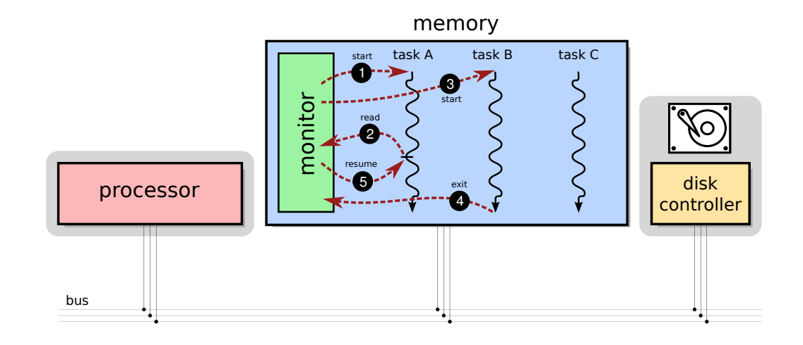
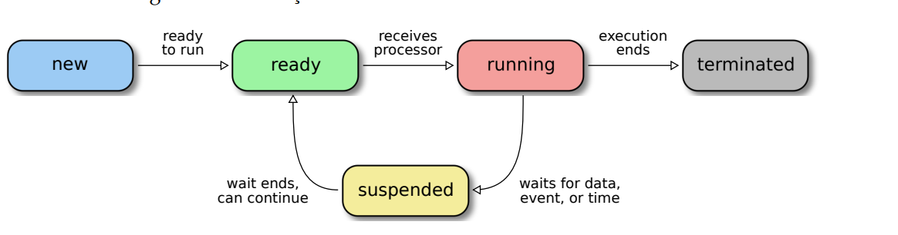
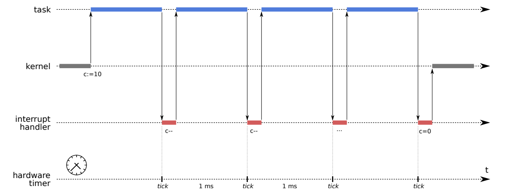
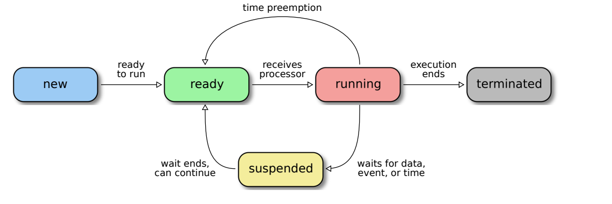
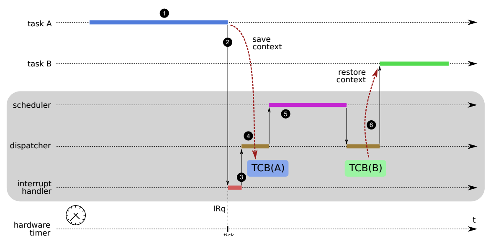
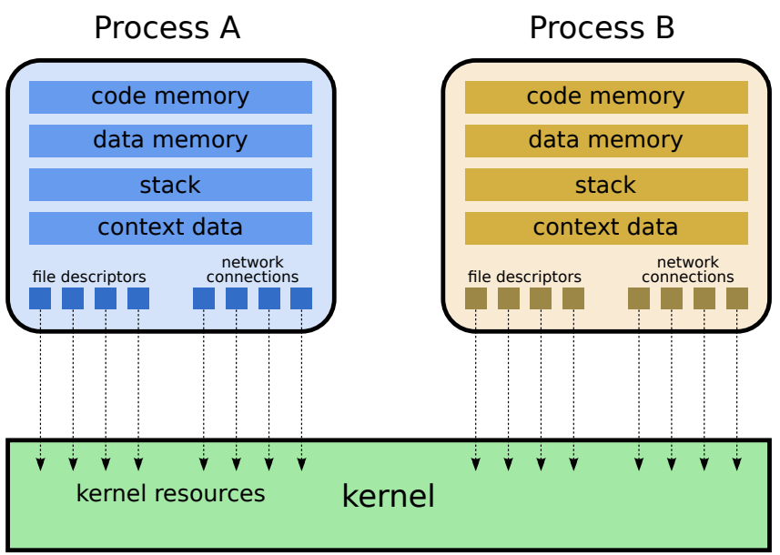
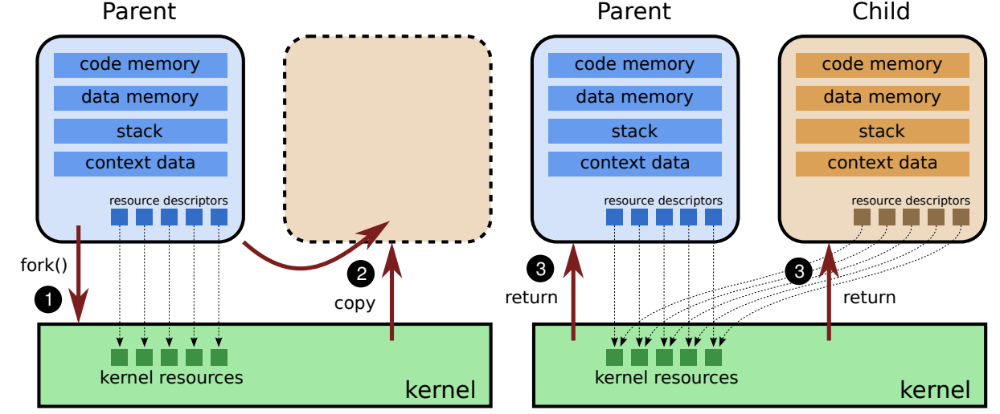
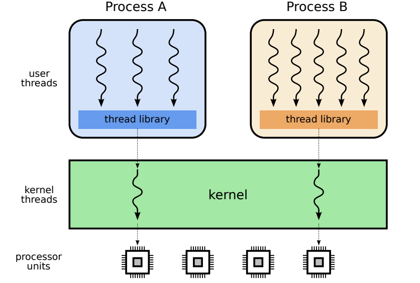
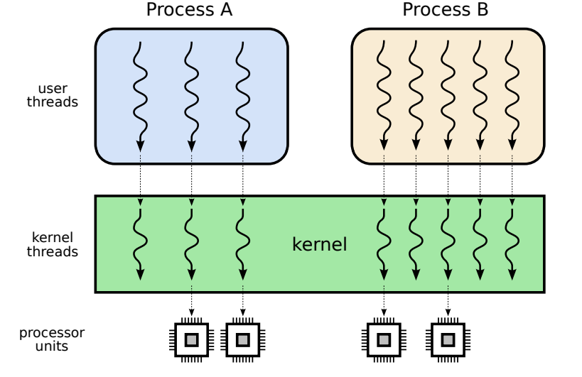
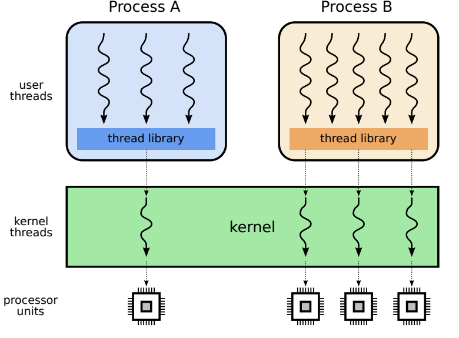

- Garante que a thread principal só continue após a thread especificada terminar.
# ⚙️ Gestão de Tarefas

Sistemas de computação geralmente têm mais tarefas a executar do que processadores disponíveis. Por isso, é necessário **multiplexar o processador**, ou seja, **compartilhá-lo entre as tarefas**.

## 🎯 Objetivos da Gestão de Tasks

- Executar várias tarefas **simultaneamente**, mesmo com processador(es) limitado(s).
- Atribuir **tempo de CPU** a cada tarefa conforme suas **necessidades**.

    - Solução ingênua :Um processador por tarefa → **Inviável** técnica e economicamente.

    - Solução prática: **Compartilhamento inteligente do processador** entre tarefas (multiplexação).

## 🔄 Conceito de Programa

**Programa** é um conjunto de uma ou mais sequências de instruções escritas para resolver
um problema específico, constituindo assim uma aplicação ou utilitário.

Representa um **conceito estático**, sem:
  - **Estado interno**
  - **Interações**

## 🔄 Conceito de Task

 **Tarefa**  é uma **execução de um fluxo sequencial de instruções** por um processador.

Representa uma **atividade dinâmica**, com:
  - **Estado interno** que muda com o tempo
  - **Interações** com o usuário, dispositivos ou outras tasks
- Pode ser implementada como **processo** ou **thread**.

### 📝 Diferença entre Programa e Task

#### A tarefa é o programa sendo executado 

| Conceito | Programa | Task |
|----------|----------|--------|
| Natureza | Estático | Dinâmico |
| Definição | Conjunto de instruções (código) | Execução das instruções por um processador |
| Estado interno | Não possui | Possui (evolui com a execução) |
| Interações | Nenhuma | Com usuário, SO e outras tarefas |
| Exemplo | `/usr/bin/vi` ou `notepad.exe` | Vim aberto editando um arquivo |


## Sistemas Multitarefas

Os **sistemas multitarefas** surgiram como evolução dos sistemas com monitor para melhorar o aproveitamento do processador, que ficava ocioso durante operações lentas de entrada/saída (E/S), como leitura de discos ou fitas magnéticas.

### 🛠 Problema
- O processador era muito mais rápido que os dispositivos de E/S.
- Enquanto uma tarefa aguardava dados externos, o processador ficava ocioso.
- Isso causava desperdício de recursos e energia.

### ✅ Solução
- Permitir que o **monitor suspenda** tarefas que estão esperando dados.
- Enquanto isso, o processador executa **outra tarefa**.
- Quando os dados estiverem prontos, a tarefa anterior é **retomada de onde parou**.

### 🔄 Funcionamento
1. Uma tarefa ativa solicita leitura de dados → é **suspensa**.
2. O monitor inicia a execução de outra tarefa.
3. Quando os dados da primeira tarefa chegam, ela é **retomada**.
4. Após a execução, a tarefa **termina** e libera recursos.




### 🔁 Estados de uma tarefa
- **Ativa**: está sendo executada.
- **Pronta**: está esperando pelo processador.
- **Suspensa**: está aguardando entrada/saída ou evento externo.




## Sistemas de Tempo Compartilhado

Os **sistemas de tempo compartilhado** (*time-sharing*) surgiram como uma evolução dos sistemas multitarefas para resolver problemas de monopolização do processador e permitir aplicações interativas.


  Implementação do tempo compartilhado

### 🛠 Problema
- Tarefas sem operações de E/S podiam executar indefinidamente, **monopolizando o processador**
- Em sistemas interativos (como editores de texto ou terminais), os usuários precisavam de **resposta rápida**
- O sistema multitarefa comum só trocava de tarefa quando havia E/S, o que não era suficiente para garantir **justiça** ou **responsividade**

### ✅ Solução
- Introduzir o conceito de **fatia de tempo** (*quantum*) para cada tarefa
- Implementar **preempção por tempo**: interromper a tarefa em execução quando seu tempo acabar, mesmo que ela não solicite E/S

  >Preempção é o ato de interromper uma tarefa em execução para transferir o controle do processador para outra tarefa.

- Criar um **escalonador** que gerencia a fila de tarefas prontas de forma circular

#### 🔄 Funcionamento
1. Cada tarefa recebe o processador por um **quantum** fixo (ex: 10–200 ms)
2. Um **temporizador de hardware** (*timer*) gera interrupções periódicas (*ticks*)
3. A cada *tick*, o contador do quantum da tarefa é decrementado
4. Quando o quantum chega a **zero**, a tarefa é **interrompida** e volta para o final da fila de prontas
5. Outra tarefa da fila recebe o processador

### 🔁 Estados de uma Tarefa (com Preempção)

| Estado | Descrição |
|--------|-----------|
| **Nova** | Tarefa sendo criada/carregada na memória |
| **Pronta** | Na memória, aguardando na fila pelo processador |
| **Executando** | Usando o processador no momento |
| **Suspensa** | Aguardando E/S, evento ou sincronização |
| **Terminada** | Finalizada, aguardando limpeza de recursos |



### ➕ Transição Adicional
- **Executando → Pronta**: ocorre por **preempção por tempo** (fim do quantum), além das transições por E/S do modelo multitarefa tradicional


---


## **Contextos**
- Cada tarefa possui um **contexto**, que inclui o estado do processador (registradores, PC, SP) e recursos utilizados (arquivos, memória, etc.).
- O **TCB** (Task Control Block) é a estrutura no núcleo que armazena:
  - Identificador, estado, contexto do processador, áreas de memória, recursos abertos, informações de gerência.

---

### **Trocas de Contexto**
- **Troca de contexto**: operação de suspender uma tarefa e retomar outra, salvando/restaurando seu contexto.
- Envolve:
  - **Despachante** (dispatcher): mecanismo de salvar/restaurar contexto. - baixo nível
  - **Escalonador** (scheduler): política de escolha da próxima tarefa.
- Eficiência:  

A eficiência do uso do processador é:

$$ \mathcal{E} = \frac{t_q}{t_q + t_{tc}} $$

Onde:
- $\mathcal{E}$ = eficiência
- $t_q$ = duração do quantum
- $t_{tc}$ = tempo de troca de contexto

#### Exemplo


**Resumo da Troca de Contexto:**

1. Tarefa A está executando.
2. O temporizador de hardware gera uma interrupção, transferindo o controle para o núcleo.
3. O despachante é ativado.
4. O estado da tarefa A é salvo em seu TCB.
5. O escalonador seleciona a próxima tarefa (B).
6. O despachante restaura o estado da tarefa B e a coloca em execução.

---

### **Implementar tarefas: Processos**
- **Processo**: contêiner de recursos (memória, arquivos, conexões) que pode conter uma ou mais tarefas.

- Hierarquia: processos formam uma árvore (Linux). No Windows, não há hierarquia.
- **PCB** (Process Control Block): descritor do processo no núcleo (PID, prioridade, recursos, etc.).



Criação no UNIX: `fork()` + `execve()`



A chamada `fork()` cria um novo processo (filho) idêntico ao processo original (pai), ambos continuando a execução a partir do ponto da chamada com o pai recebendo o PID do filho. O filho, então, normalmente executa `execve()`, que substitui seu código pelo de um novo programa, carregando um executável informado como parâmetro.

---

### **Implementar tarefas: Threads**
- **Thread**: fluxo de execução independente dentro de um processo.
- Compartilham memória e recursos do processo, mas têm contexto próprio (pilha, registradores).
- Por default, um processo tem uma thread.

- Threads de usuário: gerenciadas pela biblioteca de threads (ex: `pthread`)(dentro de um processo)

- Threads de núcleo: gerenciadas pelo sistema operacional.


  #### Algumas funções da biblioteca `pthread` em C:
  - **pthread_create**

    - Usada para criar uma nova thread.
    - Parâmetros:
      - Identificador da thread (pthread_t *thread)
      - Atributos da thread (const pthread_attr_t *attr), pode ser NULL
      - Função que a thread executará (void *(*start_routine)(void *))
      - Argumento para a função (void *arg), pode ser NULL
    - Exemplo de uso:
      ```c
      pthread_t tid;
      pthread_create(&tid, NULL, func, NULL); // cria a thread
      ```


  - **pthread_join**

    - Usada para esperar o término de uma thread.
    - Parâmetros:
      - Identificador da thread (pthread_t thread)
      - Ponteiro para valor de retorno da thread (void **retval), pode ser NULL
    - Exemplo de uso:
      ```c
      pthread_t tid;
      pthread_create(&tid, NULL, func, NULL);
      pthread_join(tid, NULL); // espera a thread terminar
      ```


  
- **Modelos de implementação**:
  - **N:1**: Múltiplas threads de usuário → 1 thread de núcleo (leve, mas sem paralelismo real).
    - Python, Ruby
    - Chamados Fibers (co-rotinas) ou Green Threads

  

  - **1:1**: Cada thread de usuário → 1 thread de núcleo (comum em sistemas modernos, suporta paralelismo).

    - Linux (Núcleo 2.6+), Windows, macOS
    - Pouco escalável (overhead de muitas threads de núcleo)

  

  - **N:M**: Híbrido; balanceia escalabilidade e desempenho.

    - Suporte multithread dentro do kernel mas também existe uma biblioteca de threads no espaço do usuário.
    -thread pool varia de acordo com a carga de trabalho.
    - Solaris, FreeBSD


  


---

### **Processos vs. Threads**
| Critério          | Processos                           | Threads                            |
|-------------------|-------------------------------------|------------------------------------|
| Criação           | Lenta                               | Rápida                             |
| Isolamento        | Alto (segurança)                    | Baixo (compartilham memória)       |
| Comunicação       | Complexa (IPC)                      | Simples (memória compartilhada)    |
| Robustez          | Alta (erro não propaga)             | Baixa (erro afeta todo o processo) |
| Exemplos          | Apache 1.*, PostgreSQL              | IIS, LibreOffice                  |
| Modelo Híbrido    | Chrome, Firefox, Apache 2.*         | Combina vantagens de ambos         |


  

---
### Lei de Amdahl

A **Lei de Amdahl** é um princípio da computação que calcula o máximo ganho de desempenho (ou **Speedup**) que se pode obter ao otimizar um sistema. Sua principal conclusão é que esse ganho é sempre limitado pela parte do sistema que não foi melhorada.

#### Termos Técnicos Principais

* **Parte Sequencial (`1 - f`):** É a fração de um programa que deve ser executada em ordem, passo a passo, e não pode ser dividida entre múltiplos processadores. Ela funciona como uma "âncora" ou um **gargalo (bottleneck)**, determinando o limite máximo de aceleração.

* **Parte Paralelizável (`f`):** É a fração do programa que pode ser dividida em tarefas menores e executada simultaneamente por vários processadores para economizar tempo.

* **N (Número de Processadores):** Refere-se à quantidade de unidades de processamento disponíveis para executar a parte paralelizável da tarefa.

* **Speedup (Aceleração):** É o fator que mede "quantas vezes mais rápido" um programa se torna após uma melhoria. É calculado pela fórmula `Speedup = 1 / ((1 - f) + f / N)`. Conforme `N` aumenta, o `Speedup` se aproxima do seu limite máximo de `1 / (1 - f)`.

Em resumo, a Lei de Amdahl nos ensina que adicionar mais processadores a um sistema tem um **retorno decrescente**: os ganhos de velocidade são grandes no início, mas se tornam cada vez menores à medida que a parte sequencial do trabalho se torna o fator dominante.