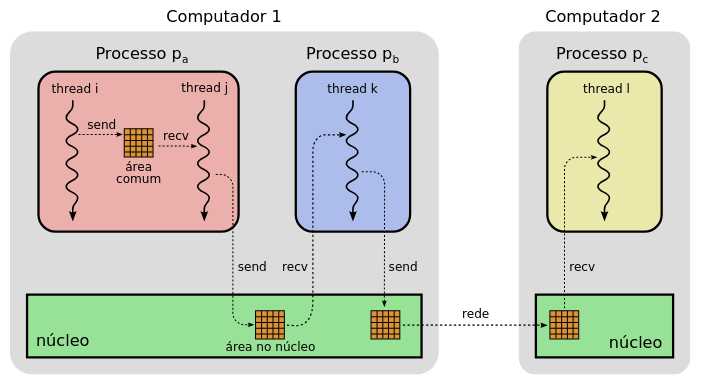
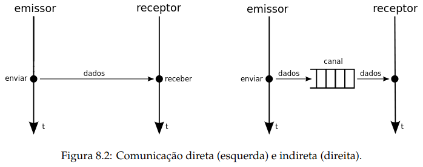
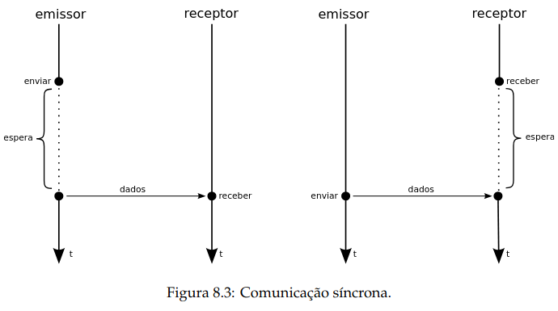
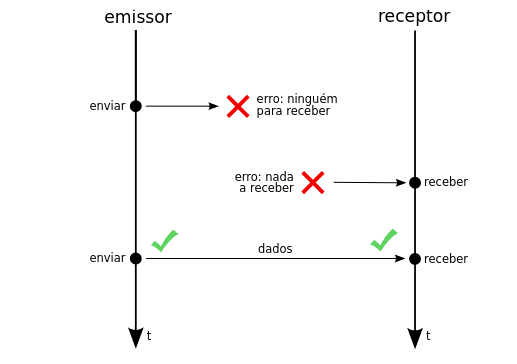
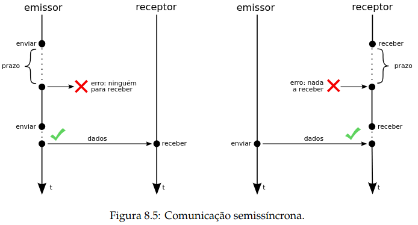
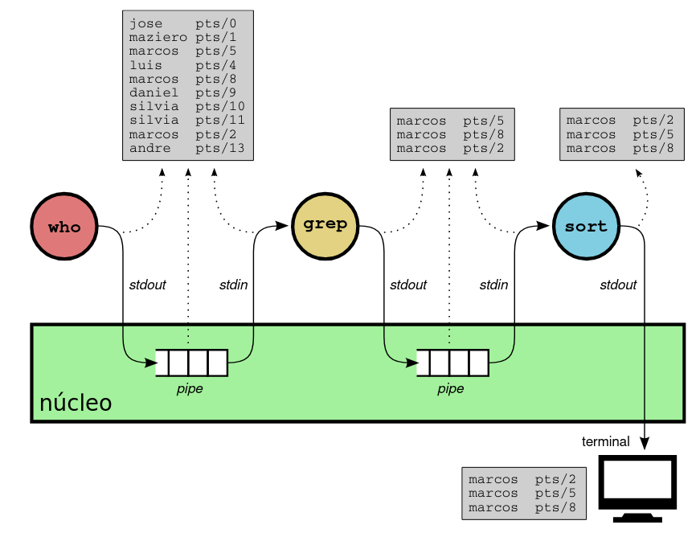
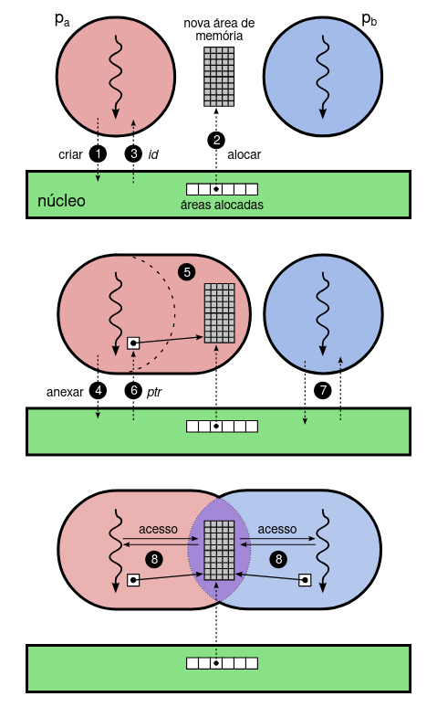

## Comunicação entre tarefas

- Cooperação = Comunicação + Coordenação


### Objetivos
- Permitir que várias tarefas cooperem em sistemas complexos.  
- Justificativas para uso de tarefas cooperantes:
  - Atender múltiplos usuários simultâneos (servidores de rede).  
  - Aproveitar multiprocessadores.  
  - Modularidade em sistemas grandes (ex: GNOME, KDE).  
  - Aplicações interativas (navegadores, jogos, editores).

### Escopo da comunicação
- **Intra-processo**: threads do mesmo processo (memória compartilhada).  
- **Inter-processos**: processos distintos, via chamadas ao núcleo.  
- **Entre sistemas**: comunicação via rede.  
- Chamados genericamente de **IPC (Inter-Process Communication)**.





### Aspectos da comunicação
- **Direta x Indireta**:
  - Direta: emissor e receptor se identificam mutuamente. (kill)
  - Indireta: via canal intermediário (ex: filas, sockets). 

   

- **Sincronismo**:
  - Síncrona (bloqueante).
    - As operações de envio/recepção podem bloquear as tarefas. 
    

  - Assíncrona (não bloqueante, exige buffer). 
    - As operações de envio/recepção retornam imediatamente. 
     

  - Semissíncrona (timeout). 
    - Operações bloqueiam por um tempo limitado.
    

- **Formato de envio** :
  - Orientado a **mensagens** (ex: filas, UDP).  
  - Orientado a **fluxo de dados** (ex: pipes, TCP).   
    - Todos os dados enviados são recebidos, mas podem chegar em pedaços diferentes.

- **Capacidade dos canais**:
  - Nula (rendez-vous).  -> devem ser feitas por comunicação direta.
  - Infinita (idealizada).  -> buffer nunca vai ser saturado.
  - Finita (mais comum).  

- **Confiabilidade**:
  - Confiável: sem perdas, sem alteração, ordenado (ex: TCP, pipes).  
  - Não confiável: perda, corrupção, desordem (ex: UDP, Ethernet).  

- **Número de participantes**:
  - 1:1 (ex: TCP, pipes).  
  - M:N:
    - Mailbox: mensagens consumidas por apenas um receptor.   
    - Barramento/event bus (publish-subscribe): mensagens distribuídas a vários.  

## Mecanismos de comunicação

### Pipes
- Canal de comunicação **unidirecional**, local, confiável, orientado a fluxo, síncrono, capacidade finita (~64 KB no Linux).  
- **Pipes nomeados (FIFOs)** persistem no sistema até serem removidos manualmente.

- Pipe em UNIX (ex: `who | grep marcos | sort`).
    

### Filas de mensagens
- Implementam conceito de **mailbox**.  
- Comunicação entre múltiplos processos (M:N).  
- **Orientadas a mensagens, confiáveis, capacidade finita**.  
- POSIX fornece API:

    - `mq_open`: abre uma fila já existente ou cria uma nova fila.
    - `mq_setattr` e `mq_getattr`: ajustam ou obtêm atributos da fila, como tamanho máximo e tamanho das mensagens.
    - `mq_send`: envia uma mensagem para a fila; se cheia, o emissor bloqueia até liberar espaço. Variante `mq_timedsend` permite definir um prazo máximo de espera.
    - `mq_receive`: recebe uma mensagem da fila; se vazia, o receptor bloqueia até chegar uma mensagem. Variante `mq_timedreceive` permite definir um prazo máximo de espera.
    - `mq_close`: fecha o descritor da fila criado por `mq_open`.
    - `mq_unlink`: remove a fila do sistema.

- Permitem operações **síncronas** ou **assíncronas**.

### Memória compartilhada
- Permite que processos distintos acessem a **mesma região de memória**.  
- Criada e gerida pelo núcleo, mas acessada diretamente pelos processos.  
- **Não provê sincronização automática**, podendo gerar inconsistências → uso de semáforos/variáveis de condição.  
- Normalmente, o hardware proíbe o compartilhamento direto de memória entre processos; o núcleo ajusta os mapas de memória para criar áreas compartilhadas.
- Comunicação é rápida, sem interferência do núcleo
- Porém, **não há mecanismos automáticos de coordenação**, exigindo o uso de técnicas adicionais para evitar condições de corrida e inconsistências.

#### Funcionamento da memória compartilhada

 


1. O processo $p_a$ solicita ao núcleo a criação de uma área de memória compartilhada;
2. O núcleo aloca uma nova área de memória e a registra em uma lista de áreas compartilháveis;
3. O núcleo devolve ao processo $p_a$ o identificador ($id$) da área alocada;
4. O processo $p_a$ solicita ao núcleo que a área identificada por $id$ seja anexada ao seu espaço de endereçamento;
5. O núcleo modifica a configuração de memória do processo $p_a$ para incluir a área indicada por $id$ em seu espaço de endereçamento;
6. O núcleo devolve a $p_a$ um ponteiro para a área alocada;
7. O processo $p_b$ executa os passos 4–6 e também recebe um ponteiro para a área alocada;
8. Os processos $p_a$ e $p_b$ comunicam-se através de escritas e leituras de valores na área de memória compartilhada.

  


- Exemplos com POSIX: `shm_open`, `ftruncate`, `mmap`

```C
// Arquivo shm.c: cria e usa uma área de memória compartilhada POSIX.
// Em Linux, compile usando: cc -Wall shm.c -o shm -lrt

#include <stdio.h>
#include <stdlib.h>
#include <fcntl.h>
#include <unistd.h>
#include <sys/types.h>
#include <sys/stat.h>
#include <sys/mman.h>

int main (int argc, char *argv[])
{
    int fd, value, *ptr ;

    // Passos 1 a 3: abre/cria uma area de memoria compartilhada
    fd = shm_open ("/sharedmem", O_RDWR|O_CREAT, S_IRUSR|S_IWUSR) ;
    if (fd == -1) {
        perror ("shm_open") ;
        exit (1) ;
    }

    // ajusta o tamanho da area compartilhada para sizeof (value)
    if (ftruncate (fd, sizeof (value)) == -1) {
        perror ("ftruncate") ;
        exit (1) ;
    }

    // Passos 4 a 6: mapeia a area no espaco de enderecamento deste processo
    ptr = mmap (NULL, sizeof(value), PROT_READ|PROT_WRITE, MAP_SHARED, fd, 0) ;
    if (ptr == MAP_FAILED) {
        perror ("mmap") ;
        exit (1) ;
    }

    for (;;) {
        // Passo 8: escreve um valor aleatorio na area compartilhada
        value = random () % 1000 ;
        (*ptr) = value ; // escreve na area
        printf ("Wrote value %i\n", value) ;
        sleep (1) ;

        // Passo 8: le e imprime o conteudo da area compartilhada
        value = (*ptr) ; // le da area
        printf ("Read value %i\n", value) ;
        sleep (1) ;
    }
}
``` 