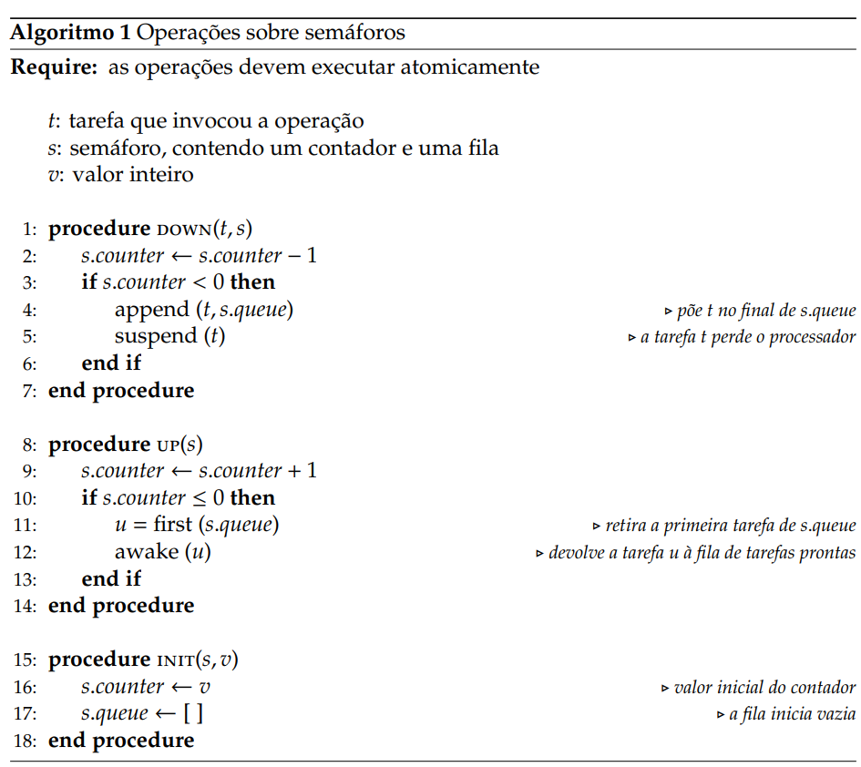
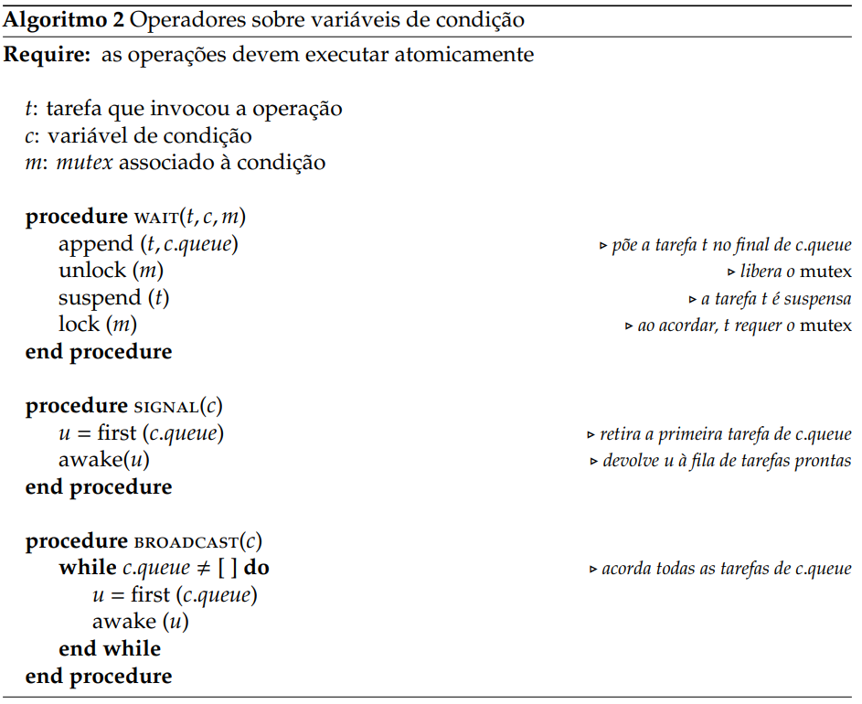
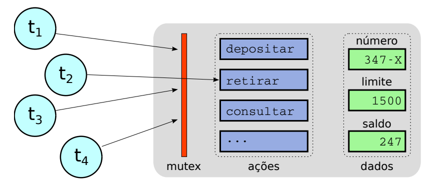

# Conceitos e Mecanismos

## Coordenação entre Tarefas

### Problema da Concorrência
- Em aplicações reais (ex.: banco, navegador), várias tarefas cooperam acessando recursos comuns.  
- Se acessos forem simultâneos → risco de inconsistência.  
- Exemplo: depósitos concorrentes em uma conta bancária podem fazer com que valores se percam.  

### Condições de Disputa (Race Conditions)
- Ocorrem quando resultados finais dependem da ordem de execução entre tarefas.  
- São **erros dinâmicos** (não aparecem no código fonte) e difíceis de reproduzir.
- Envolvem ao menos uma operação de escrita em recurso compartilhado.


Exemplo de condição de disputa:
```C
 void depositar (long * saldo, long valor){
    (*saldo) += valor ;
 }
```
> Não Concorrentes


> Concorrentes


### Condições de Bernstein
Para que duas tarefas `t1` e `t2` possam executar em paralelo($t_1 || t_2$) sem disputa:
- `R(t1) ∩ W(t2) = ∅` (t1 não lê variáveis escritas por t2).  
- `R(t2) ∩ W(t1) = ∅` (t2 não lê variáveis escritas por t1).  
- `W(t1) ∩ W(t2) = ∅` (não escrevem nas mesmas variáveis).  

    - `R(t)` = conjunto de variáveis lidas por `t`
    - `W(t)` = conjunto de variáveis escritas por `t`.
### Seções Críticas
- Trechos de código que acessam variáveis/recursos compartilhados.  
- Regra: apenas **uma tarefa por vez** deve estar na seção crítica (exclusão mútua).  

### Critérios para boas soluções
1. Exclusão mútua garantida.  
2. Espera limitada (sem starvation).  
3. Independência (apenas tarefas interessadas influenciam).  
4. Independência de fatores físicos (não depender de clocks, nº de CPUs, etc).  
    >Não pode só colocar um sleep()

### Soluções estudadas
- **Inibição de interrupções**:Inibir troca de contextos, mas só funciona em sistemas monoprocessados (ex. embarcados) e pode travar todo o sistema, pois a preempção é desativada.


- **Solução trivial (`busy`)**: usa variável de estado(flag) → gera uma condição de disputa na variável _busy_.

    Exemplo:

    ```c
    int busy = 0; // seção inicialmente livre

    void enter() {
        while (busy) {
            // espera enquanto a seção estiver ocupada
        }
        busy = 1; // marca a seção como ocupada
    }

    void leave() {
        busy = 0; // libera a seção (marca como livre)
    }
    ```

    


- **Alternância de uso**: criar uma variável `turn` que força ordem fixa →.

    ```c
        int turn = 0; // tarefa 0 tem a vez inicialmente
        int num_tasks;

        void enter(int task) {
            while (turn != task) {
                // espera enquanto não for a vez da tarefa
            }
        }

        void leave(int task) {
            turn = (turn + 1) % num_tasks; // passa a vez para a próxima tarefa
        }
    ```


- **Algoritmo de Dekker e Peterson**: solução correta para 2 tarefas, usa duas variáveis (interesse + vez).

    ```c
        int turn; // indica de quem é a vez
        int interested[2] = {0, 0}; //a tarefa i quer entrar?

        void enter(int task) { // task = 0 ou 1
            int other = 1 - task; // id da outra tarefa
            interested[task] = 1; //task quer acessar a seção crítica
            turn = task;
            while (interested[other] && turn == task) {
                // espera enquanto a outra tarefa estiver interessada e for a vez dela
            }
        }

        void leave(int id) {
            interested[id] = 0;
        }

    ```

- **Algoritmos para múltiplas tarefas**: ex. de Dekker, Eisenberg & McGuire, algoritmo de Lamport (Bakery Algorithm).

- **Instruções atômicas**: hardware fornece primitivos (`test-and-set`, `compare-and-swap`, `xchg` ).

- **Spinlocks**: baseados em espera ocupada, úteis em trechos curtos dentro do kernel.  


## Mecanismos de Coordenação

### Limitações das soluções simples
- Ineficientes (espera ocupada consome CPU).  
- Injustas (algumas tarefas podem nunca entrar).  
- Pouco escaláveis.  

### Semáforos (Dijkstra, 1965)
- Estrutura: contador inteiro + fila de espera e operações de acesso.  
- Operações:
  - `down(s)` (P): tenta decrementar; suspende a tarefa e a põe na fila.  
  - `up(s)` (V): tenta incrementar; acorda uma tarefa da fila.  
  - `init(s,v)`: inicializa semáforo com valor `v`. 




- Vantagens:
  - **Eficiência**: tarefas bloqueadas não gastam CPU.  
  - **Justiça**: fila FIFO.  
  - **Flexibilidade**: controle de exclusão mútua, sincronização de eventos e contagem de recursos.  
- Exemplos:  
  - Controle de estacionamento (cada vaga = recurso).  
  - Exclusão mútua em conta bancária.  

- Implementação pela biblioteca POSIX (`sem_init`, `sem_wait`, `sem_post`, etc).
    ```C
    #include <semaphore.h>
    sem_t sem; // declaração do semáforo

    int sem_init(sem_t *sem, int pshared, unsigned int value); // inicializa o semáforo.
    // pshared = 0 (entre threads do mesmo processo), pshared != 0 (entre processos diferentes)
    // value = valor inicial do semáforo.

    int sem_wait(sem_t *sem); // operação de down (P).

    int sem_post(sem_t *sem); // operação de up (V).

    int sem_trywait(sem_t *sem); // retorna erro se o semáforo estiver ocupado.

    ```

### Mutexes
- Versão simplificada dos semáforos (binários: 0 ou 1).    
- Garantem exclusão mútua simples. 
- Operações típicas: `lock`, `unlock`, `trylock`.  
- Exemplo de uso em POSIX:
    ```C
    #include <pthread.h>
    pthread_mutex_t mutex; // declaração do mutex

    int pthread_mutex_init(pthread_mutex_t *mutex, const pthread_mutexattr_t *attr); // inicializa o mutex.
    // attr = NULL (atributos padrão).
    int pthread_mutex_lock(pthread_mutex_t *mutex); // bloqueia o mutex (entra na seção crítica).

    int pthread_mutex_unlock(pthread_mutex_t *mutex); // desbloqueia o mutex (sai da seção crítica).

    int pthread_mutex_destroy(pthread_mutex_t *mutex); // destrói o mutex.
    ```

### Variáveis de Condição
- Permitem que tarefas esperem por uma condição lógica (ex.: buffer cheio/vazio).  
- Associadas a **um mutex** para garantir segurança.  
- Operações:  
  - `wait(c, m)`: libera mutex e suspende tarefa.  
  - `signal(c)`: acorda uma tarefa.  
  - `broadcast(c)`: acorda todas as tarefas.  
- Usadas em problemas como **produtor-consumidor**.  
- Semânticas:
  - **Hoare**: sinalização transfere imediatamente o controle → pouco usada.  
  - **Mesa** (POSIX): sinalização apenas acorda, programador deve liberar mutex.  



### Monitores
- Estrutura de alto nível que **encapsula dados e métodos sincronizados**.  
- Sincronização é automática → mais seguro que semáforos/mutexes.  
- Evita erros como esquecer `unlock`.  
- Usado em linguagens como Java, C#, etc.  




