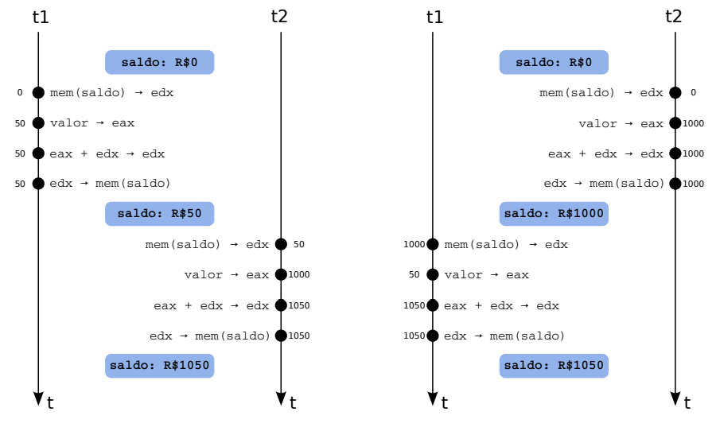
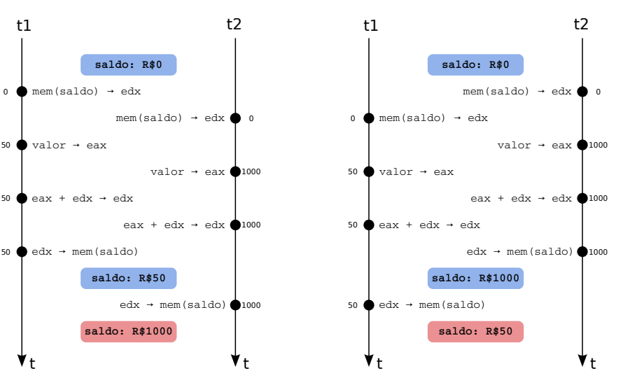
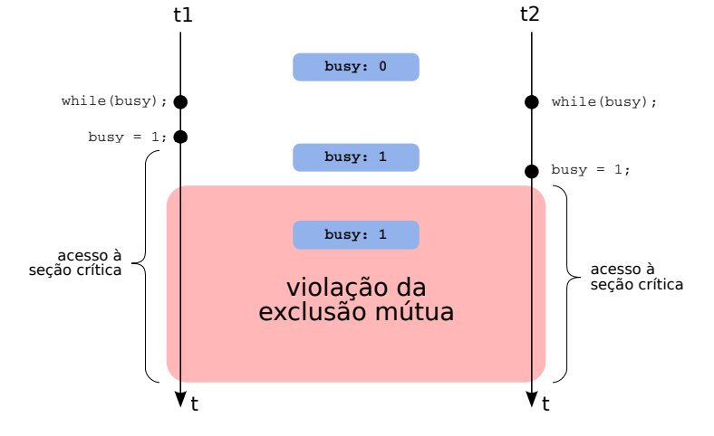

# Conceitos e Mecanismos

## Coordenação entre Tarefas

### Problema da Concorrência
- Em aplicações reais (ex.: banco, navegador), várias tarefas cooperam acessando recursos comuns.  
- Se acessos forem simultâneos → risco de inconsistência.  
- Exemplo: depósitos concorrentes em uma conta bancária podem fazer com que valores se percam.  

### Condições de Disputa (Race Conditions)
- Ocorrem quando resultados finais dependem da ordem de execução entre tarefas.  
- São **erros dinâmicos** (não aparecem no código fonte) e difíceis de reproduzir.
- Envolvem ao menos uma operação de escrita em recurso compartilhado.


Exemplo de condição de disputa:
```C
 void depositar (long * saldo, long valor){
    (*saldo) += valor ;
 }
```
> Não Concorrentes


> Concorrentes



### Condições de Bernstein
Para que duas tarefas `t1` e `t2` possam executar em paralelo($t_1 || t_2$) sem disputa:
- `R(t1) ∩ W(t2) = ∅` (t1 não lê variáveis escritas por t2).  
- `R(t2) ∩ W(t1) = ∅` (t2 não lê variáveis escritas por t1).  
- `W(t1) ∩ W(t2) = ∅` (não escrevem nas mesmas variáveis).  

    - `R(t)` = conjunto de variáveis lidas por `t`
    - `W(t)` = conjunto de variáveis escritas por `t`.
### Seções Críticas
- Trechos de código que acessam variáveis/recursos compartilhados.  
- Regra: apenas **uma tarefa por vez** deve estar na seção crítica (exclusão mútua).  

### Critérios para boas soluções
1. Exclusão mútua garantida.  
2. Espera limitada (sem starvation).  
3. Independência (apenas tarefas interessadas influenciam).  
4. Independência de fatores físicos (não depender de clocks, nº de CPUs, etc).  
    >Não pode só colocar um sleep()

### Soluções estudadas
- **Inibição de interrupções**: simples, mas só funciona em sistemas monoprocessados (ex. embarcados) e pode travar todo o sistema, pois a preempção é desativada.


- **Solução trivial (`busy`)**: usa variável de estado(flag) → gera uma condição de disputa na variável _busy_.
    Exemplo:

    ```c
    int busy = 0; // seção inicialmente livre

    void enter() {
        while (busy) {
            // espera enquanto a seção estiver ocupada
        }
        busy = 1; // marca a seção como ocupada
    }

    void leave() {
        busy = 0; // libera a seção (marca como livre)
    }
    ```

    


- **Alternância de uso**: variável `turn` que força ordem fixa → pode bloquear tarefas que não querem usar a seção crítica.

```c
    int turn = 0; // tarefa 0 tem a vez inicialmente

    void enter(int id) {
        while (turn != id) {
            // espera enquanto não for a vez da tarefa
        }
    }

    void leave(int id) {
        turn = (id + 1) % 2; // passa a vez para a outra tarefa
    }
```


- **Algoritmo de Peterson**: solução correta para 2 tarefas, usa duas variáveis (interesse + vez).

```c
    int turn;
    int interested[2] = {0, 0};

    void enter(int id) {
        interested[id] = 1;
        turn = id;
        while (interested[1 - id] && turn == id) {
            // espera enquanto a outra tarefa estiver interessada e for a vez dela
        }
    }

    void leave(int id) {
        interested[id] = 0;
    }

```

- **Algoritmos para múltiplas tarefas**: ex. de Dekker, Eisenberg & McGuire.

- **Instruções atômicas**: hardware fornece primitivos (`test-and-set`, `compare-and-swap`).

- **Spinlocks**: baseados em espera ocupada, úteis em trechos curtos dentro do kernel.  


## Mecanismos de Coordenação

### Limitações das soluções simples
- Ineficientes (espera ocupada consome CPU).  
- Injustas (algumas tarefas podem nunca entrar).  
- Pouco escaláveis.  

### Semáforos (Dijkstra, 1965)
- Estrutura: contador inteiro + fila de espera.  
- Operações:
  - `down(s)` (P): tenta decrementar; bloqueia se não houver recurso.  
  - `up(s)` (V): incrementa; acorda tarefa se houver fila.  
  - `init(s,v)`: inicializa semáforo com valor `v`.  
- Vantagens:
  - **Eficiência**: tarefas bloqueadas não gastam CPU.  
  - **Justiça**: fila FIFO.  
  - **Flexibilidade**: controle de exclusão mútua, sincronização de eventos e contagem de recursos.  
- Exemplos:  
  - Controle de estacionamento (cada vaga = recurso).  
  - Exclusão mútua em conta bancária.  

### Mutexes
- Versão simplificada dos semáforos (binários: 0 ou 1).  
- Muito usados em sistemas POSIX e Windows.  
- Operações típicas: `lock`, `unlock`, `trylock`.  
- Garantem exclusão mútua simples.  

### Variáveis de Condição
- Permitem que tarefas esperem por uma condição lógica (ex.: buffer cheio/vazio).  
- Associadas a **um mutex** para garantir segurança.  
- Operações:  
  - `wait(c, m)`: libera mutex e suspende tarefa.  
  - `signal(c)`: acorda uma tarefa.  
  - `broadcast(c)`: acorda todas as tarefas.  
- Usadas em problemas como **produtor-consumidor**.  
- Semânticas:
  - **Hoare**: sinalização transfere imediatamente o controle → pouco usada.  
  - **Mesa** (POSIX): sinalização apenas acorda, programador deve liberar mutex.  

### Monitores
- Estrutura de alto nível que **encapsula dados e métodos sincronizados**.  
- Sincronização é automática → mais seguro que semáforos/mutexes.  
- Evita erros como esquecer `unlock`.  
- Usado em linguagens como Java, C#, etc.  


## Impasses (Deadlocks)

### Definição
- Estado em que tarefas ficam **bloqueadas permanentemente** aguardando recursos umas das outras.  
- Nenhuma tarefa consegue prosseguir, mesmo havendo processamento disponível.  

### Exemplo Clássico
- Duas transferências bancárias entre contas diferentes → cada tarefa segura um mutex e espera pelo outro.  

### Condições necessárias (Coffman, 1971)
1. **Exclusão mútua** (um recurso só pode ser usado por uma tarefa).  
2. **Posse e espera** (tarefa mantém recursos já adquiridos enquanto solicita outros).  
3. **Não-preempção** (recurso só é liberado voluntariamente).  
4. **Espera circular** (ciclo de dependências).  

> Se **uma** dessas condições for eliminada, não há impasse.

### Grafos de Alocação de Recursos
- Tarefas = círculos; recursos = retângulos.  
- Alocação = seta recurso → tarefa.  
- Requisição = seta tarefa → recurso.  
- Ciclos → indicam possível impasse.  
- Com **recursos únicos** → ciclo = impasse.  
- Com **múltiplas instâncias** → ciclo pode ser resolvido.  

### Técnicas de Tratamento
1. **Prevenção**: impedir que as condições de Coffman se formem.  
   - Spooling (ex.: impressoras).  
   - Solicitar todos os recursos de uma vez.  
   - Time-out em requisições.  
   - Ordem global de recursos.  
2. **Impedimento**: manter o sistema em estados **seguros**.  
   - Exemplo: **Algoritmo do Banqueiro** (Dijkstra).  
   - O sistema só concede recursos se isso não levar a um estado inseguro.  
3. **Detecção e Recuperação**:  
   - Permite impasses, mas detecta ciclos periodicamente.  
   - Estratégias de recuperação:  
     - Encerrar tarefas.  
     - Preemptar recursos.  
     - Reverter transações.  

### Situação Prática
- Sistemas operacionais modernos (Linux, Windows, macOS) **não implementam tratamento de impasses no núcleo**.  
- Responsabilidade é deixada para os desenvolvedores de aplicações.  

---
