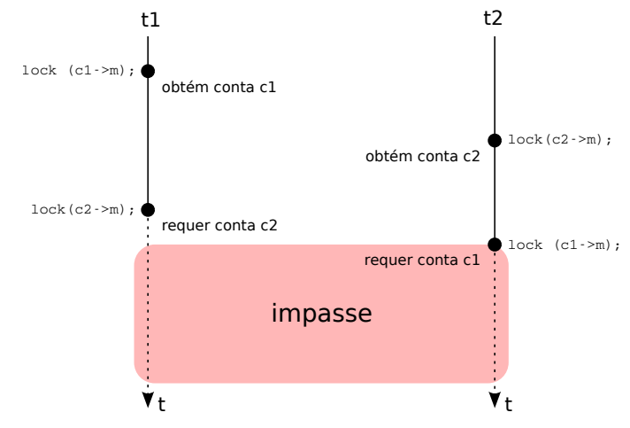

## Impasses (Deadlocks)

### Definição
- Estado em que tarefas ficam **bloqueadas** aguardando recursos umas das outras.  
- Nenhuma tarefa consegue prosseguir, mesmo havendo processamento disponível.  

### Exemplo Clássico
```c
typedef struct conta_t
{
   int saldo;      // saldo atual da conta
   mutex m;        // mutex associado à conta
   // outras informações da conta
} conta_t;

void transferir(conta_t* contaDeb, conta_t* contaCred, int valor)
{
   lock(contaDeb->m);      // obtém acesso à contaDeb
   lock(contaCred->m);     // obtém acesso à contaCred

   if (contaDeb->saldo >= valor)
   {
      contaDeb->saldo -= valor;   // debita valor de contaDeb
      contaCred->saldo += valor;  // credita valor em contaCred
   }

   unlock(contaDeb->m);    // libera acesso à contaDeb
   unlock(contaCred->m);   // libera acesso à contaCred
}
```


### Condições necessárias (Coffman, 1971)
1. **Exclusão mútua** (um recurso só pode ser usado por uma tarefa).  
2. **Posse e espera** (tarefa mantém recursos já adquiridos enquanto solicita outros).  
3. **Não-preempção** (recurso só é liberado voluntariamente).  
4. **Espera circular** (ciclo de dependências).  

> Se **uma** dessas condições for eliminada, não há impasse.

### Grafos de Alocação de Recursos


- Tarefas = círculos; recursos = retângulos.  
- Alocação = seta recurso → tarefa.  
- Requisição = seta tarefa → recurso.  
- Ciclos → indicam possível impasse.  
- Com **recursos únicos** → ciclo = impasse.  
- Com **múltiplas instâncias** → ciclo pode ser resolvido. 


### Técnicas de Tratamento
1. **Prevenção**: impedir que as condições de Coffman se formem.  
   - Spooling (ex.: impressoras).  
   - Solicitar todos os recursos de uma vez.  
   - Time-out em requisições.  
   - Ordem global de recursos.  
2. **Impedimento**: manter o sistema em estados **seguros**.  
   - Exemplo: **Algoritmo do Banqueiro** (Dijkstra).  
   - O sistema só concede recursos se isso não levar a um estado inseguro.  
3. **Detecção e Recuperação**:  
   - Permite impasses, mas detecta ciclos periodicamente.  
   - Estratégias de recuperação:  
     - Encerrar tarefas.  
     - Preemptar recursos.  
     - Reverter transações.  

### Situação Prática - Resolvendo Impasse atuando na posse e espera
```c
typedef struct conta_t
{
   int saldo;      // saldo atual da conta
   mutex m;        // mutex associado à conta
   // outras informações da conta
} conta_t;

void transferir(conta_t* contaDeb, conta_t* contaCred, int valor)
{
   lock(contaDeb->m);      // obtém acesso à contaDeb

   if (contaDeb->saldo >= valor)
   {
      contaDeb->saldo -= valor;   // debita valor de contaDeb
   }
   
   unlock(contaDeb->m);    // libera acesso à contaDeb

   lock(contaCred->m);     // obtém acesso à contaCred

   contaCred->saldo += valor;  // credita valor em contaCred

   unlock(contaCred->m);   // libera acesso à contaCred
}
```

### Situação Prática - Resolvendo Impasse atuando na ordem global de recursos - espera circular
```c
typedef struct conta_t
{
   int saldo;      // saldo atual da conta
   int id;         // identificador único da conta
   mutex m;        // mutex associado à conta
   // outras informações da conta
} conta_t;

void transferir(conta_t* contaDeb, conta_t* contaCred, int valor)
{
   conta_t* primeira;
   conta_t* segunda;

   // Define ordem global baseada no id
   if (contaDeb->id < contaCred->id)
   {
      primeira = contaDeb;
      segunda = contaCred;
   }
   else
   {
      primeira = contaCred;
      segunda = contaDeb;
   }

   lock(primeira->m);      // sempre trava primeiro o menor id
   lock(segunda->m);       // depois trava o maior id

   if (contaDeb->saldo >= valor)
   {
      contaDeb->saldo -= valor;   // debita valor de contaDeb
      contaCred->saldo += valor;  // credita valor em contaCred
   }

   unlock(segunda->m);     // libera o maior id
   unlock(primeira->m);    // libera o menor id
}
```
---
