# Escalonamento de Tarefas

O escalonamento é o mecanismo do sistema operacional responsável por decidir **qual tarefa será executada e em que ordem**. Ele afeta diretamente o desempenho, a interatividade e a eficiência do sistema.

## 🔹Tipos de tarefas
- **Tempo real** → exigem previsibilidade rígida (controle industrial, aviônicos).  
- **Interativas** → precisam de respostas rápidas, mas não críticas (editores, navegadores, jogos).  
- **Em lote (batch)** → executam em segundo plano, sem urgência (backup, renderização).  

Quanto ao uso da CPU:  
- **CPU-bound** → usam intensamente o processador.  
- **I/O-bound** → passam mais tempo aguardando E/S.  

##  🔹Objetivos e métricas
- **Desempenho**: melhor aproveitamento da CPU.  
- **Tempo de resposta**: rapidez para interatividade.  
- **Justiça**: todas as tarefas devem progredir.  
- **Previsibilidade**: comportamento consistente.  

Métricas:  
- **Turnaround time (Tt)** → chegada até término.  
- **Waiting time (Tw)** → tempo na fila.  
- **Tempo de resposta(Tr)** → tempo entre a chegada de um evento e a resposta a ele.
- **Justiça (Jus)** → distribuição adequada da cpu entre as tarefas.

## 🔹 Modos de Escalonamento
- **Preemptivo** → SO pode retirar a CPU de uma tarefa (ex.: Linux, Windows NT).  
- **Cooperativo** → tarefa libera voluntariamente a CPU 

## 🔹 Algoritmos de escalonamento

Primeiro vamos definir um caso de estudo com 5 tarefas.

| Tarefa | Ingresso | Duração | Prioridade |
|--------|---------:|--------:|-----------:|
| t1     | 0        | 5       | 2          |
| t2     | 0        | 2       | 3          |
| t3     | 1        | 4       | 1          |
| t4     | 3        | 1       | 4          |
| t5     | 5        | 2       | 5          |

### **FCFS (First-Come, First-Served)**
- Ordem de chegada (FIFO - First In, First Out).  
- Simples, mas pode gerar longas esperas (efeito "convoy" - quando uma tarefa longa atrasa todas as seguintes).

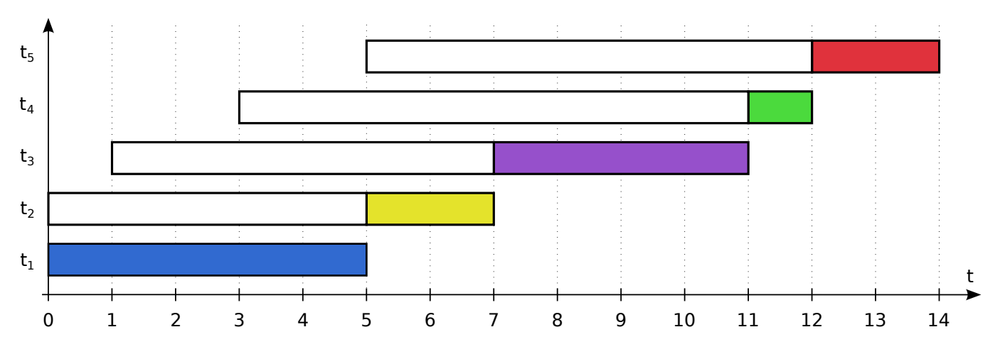
- **Cálculo dos tempos:**
    - $T_t = \frac{ 5 + 7 + (11-1) + (12-3) + (14-5)}{5} = \frac{40}{5} = 8,0$

    - $T_w = \frac{0 + 5 + (7-1) + (11-3) + (12-5)}{5} = \frac{26}{5} = 5,2$

### **RR (Round-Robin)**
- Quantum de tempo para cada tarefa.  
- Um FCFS com preempção.  
- Muitas trocas de contexto.

**Escalonamento RR fila:**

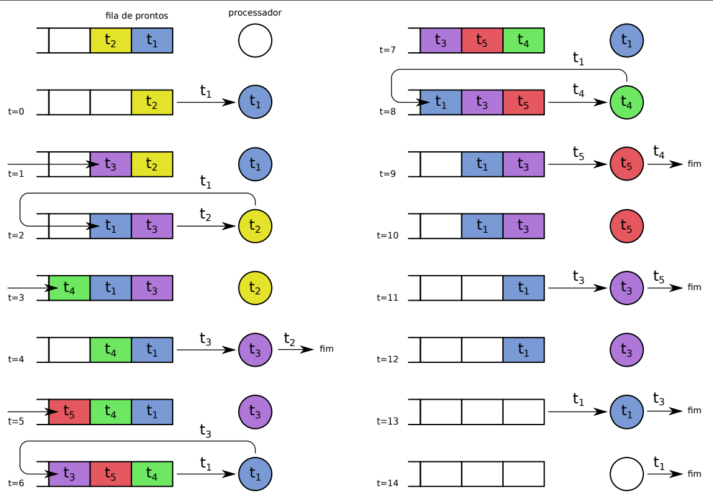

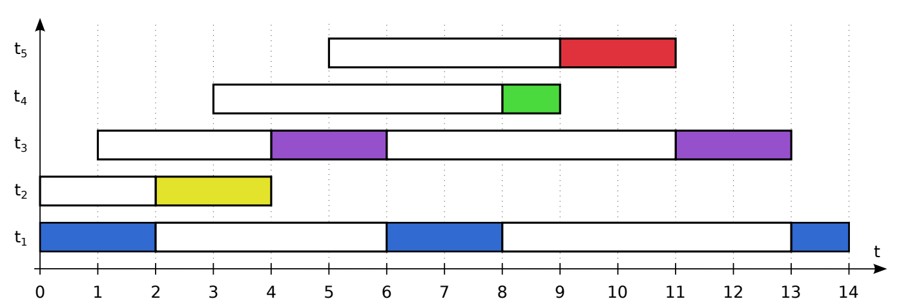

- **Cálculo dos tempos:**
    - $T_t = \frac{ 14 + 4 + 12 + 6 + 6 }{5} = \frac{42}{5} = 8,4$

    - $T_w = \frac{(4+5) + 2 + (3 + 5) + 5 + 4}{5} = \frac{28}{5} = 5,6$

### **SJF (Shortest Job First)**
- Executa a tarefa mais curta.  
- Ótimos tempos médios, mas difícil prever duração.  
 
 **Problema:**
    Como prever a duração de uma tarefa?

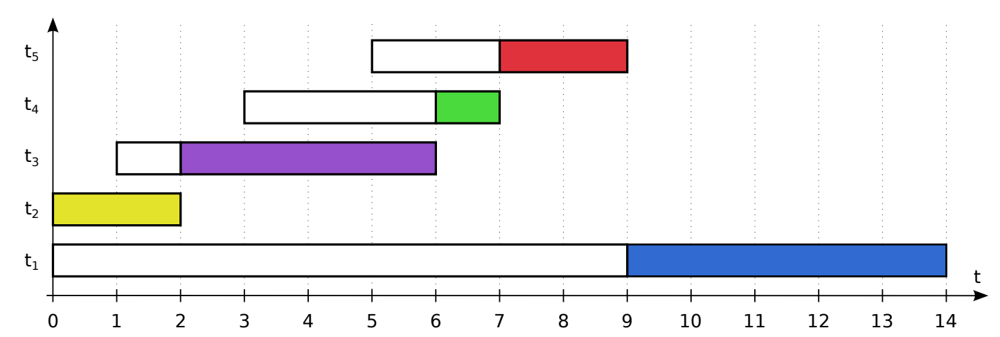

- **Cálculo dos tempos:**
    - $T_t = \frac{ 14 + 2 + 5 + 4 + 4}{5} = \frac{29}{5} = 5,8$

    - $T_w = \frac{9 + 0 + 1 + 3 + 2}{5} = \frac{15}{5} = 3,0$

### **SRTF (Shortest Remaining Time First)**
- Versão preemptiva do SJF.  
- Favorece curtas, mas pode causar **inanição(starvation)** em longas.  

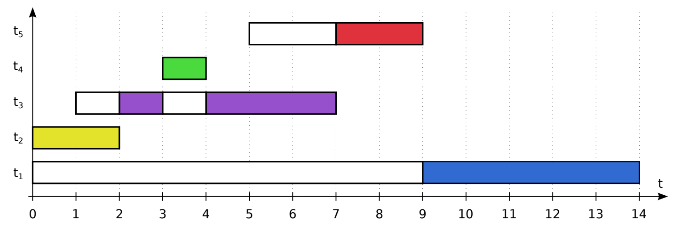
- **Cálculo dos tempos:**
    - $T_t = \frac{ 14 + 2 + 6 + 1 + 4}{5} = \frac{27}{5} = 5,4$

    - $T_w = \frac{9 + 0 + 2 + 0 + 2}{5} = \frac{13}{5} = 2,6$

### **Prioridades fixas (PRIOc e PRIOp)**

 **Cooperativo (PRIOc)** → só libera voluntariamente.  

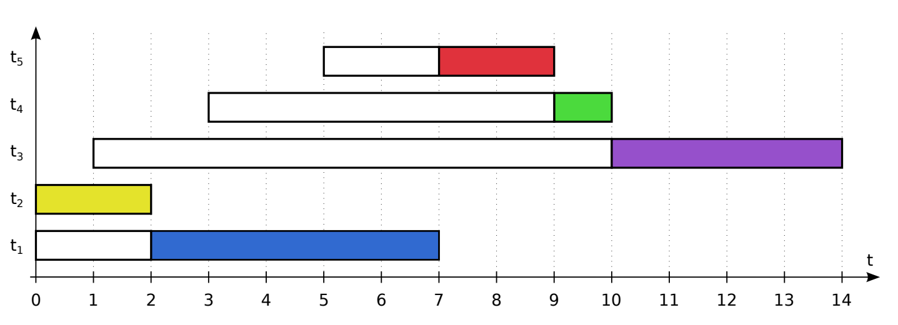

- **Cálculo dos tempos:**
    - $T_t = \frac{ 7 + 2 + 13 + 7 + 4}{5} = \frac{33}{5} = 6,6$

    - $T_w = \frac{2 + 0 + 9 + 6 + 2}{5} = \frac{19}{5} = 3,8$

 **Preemptivo (PRIOp)** → pode ser interrompida por tarefa mais prioritária.  

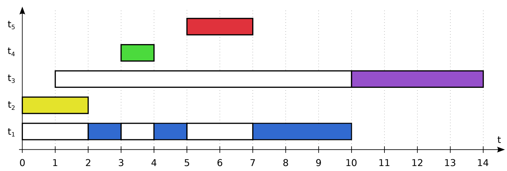

- **Cálculo dos tempos:**
    - $T_t = \frac{ 10 + 2 + 13 + 1 + 2}{5} = \frac{28}{5} = 5,6$

    - $T_w = \frac{5 + 0 + 9 + 0 + 0}{5} = \frac{14}{5} = 2,8$

### **Prioridades dinâmicas (PRIOd)**
- Introduz **envelhecimento (aging)** - tarefas ganham prioridade com o tempo.
- Ao executar, a prioridade volta ao valor original.

### **Um Algoritmo de envelhecimento**

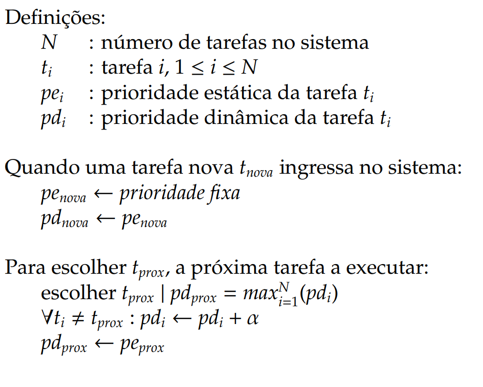

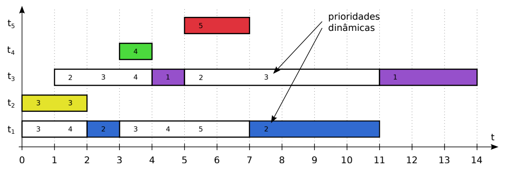

- **Cálculo dos tempos:**
    - $T_t = \frac{ 11 + 2 + 13 + 1 + 2}{5} = \frac{29}{5} = 5,8$

    - $T_w = \frac{6 + 0 + 9 + 0 + 0}{5} = \frac{15}{5} = 3,0$

### Efeito da prioridade dinâmica
Round-robin ($T_q = 1$) e prioridades $t_1: 1,\ t_2: 2,\ t_3: 3$

**Sem envelhecimento:**
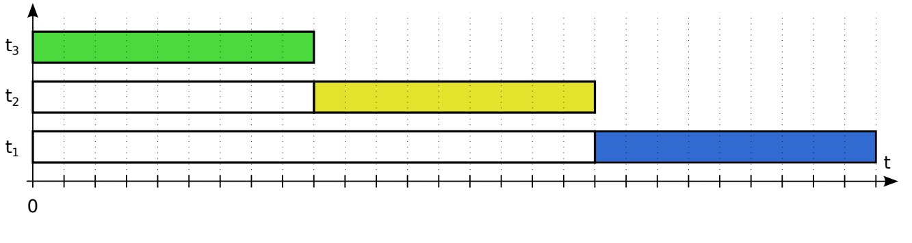

**Com envelhecimento:**
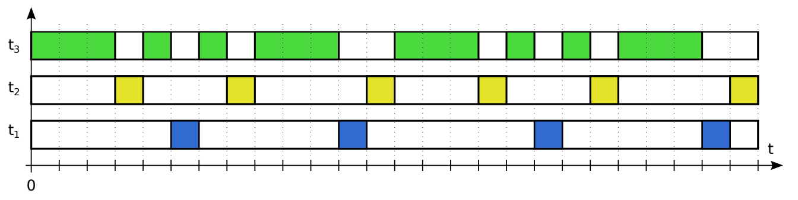

### **Comparação**
- **SRTF** → melhor tempo médio.  
- **RR** → melhor resposta interativa.  
- **FCFS** → simples, mas ineficiente em cargas mistas.  

### **Outros algoritmos**
- Múltiplas filas com feedback (MLFQ).  
- Fair share.  
- Tempo real e multimídia.  

## 🔹 Inversão de Prioridades

Ocorre quando uma tarefa de alta prioridade é bloqueada por uma tarefa de baixa prioridade devido ao uso de um recurso de exclusão mútua. - Ocorreu na Sonda Mars Pathfinder.

- $t_a: \text{tarefa de alta prioridade}$

- $t_b: \text{tarefa de baixa prioridade}$

- $t_m: \text{tarefa de prioridade intermediária}$

- $R: \text{recurso acessado em exclusão mútua}$

 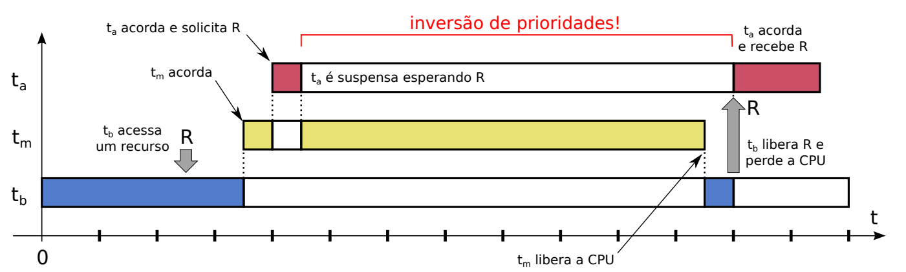

**Inversão** -> $t_a$ espera $t_b$ liberar $R$, mas $t_b$ não pode prosseguir porque $t_m$ está executando.

**Solução: Herança de Prioridade**

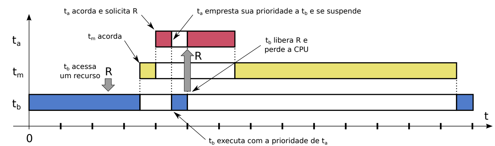

1. $t_a$ pede acesso ao recurso $R$ (que está com $t_b$)
2. $t_a$ “empresta” sua prioridade a $t_b$
3. $t_b$ passa à frente das demais tarefas na fila
4. $t_b$ consegue executar e liberar $R$
5. $t_b$ retorna à sua prioridade anterior
6. $t_a$ volta a executar e obtém acesso a $R$